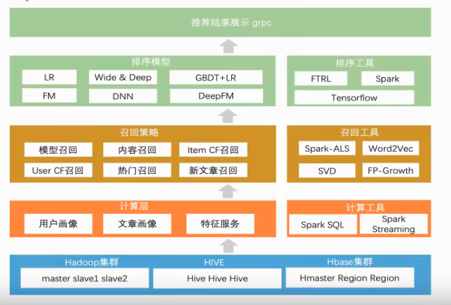

## 基础
1. 为啥需要推荐系统
    
      信息过载  ： 信息量很多，不知道自己喜欢什么
      用户需求不明确 ：

2. 同类型发展
    分类目录  ：  分类推荐
    搜索引擎  ：  用户明确知道需要什么
    推荐系统  ：  用户不知道自己需要什么，

3. 搜索引擎  推荐系统
    主动，意图明确，个性化弱，
    被动，意图模糊，个性化强

4. 作用
   高效连接用户和物品，发现长尾商品
   留住用户和内容生产者，实现商业目标

5. 工作原理
   （1） 社会化推荐  ： 朋友推荐
   （2） 基于内容的推荐 ： 
   （3） 基于流行度的推荐 ： 电影票房
   （4） 基于协同过滤的推荐 ： 找到和自己兴趣相似的用户，

6. 工具
   flume  hadoop   nosql  mysql   flink 

7. 

## 头条推荐

点击行为，流浪行为，收藏行为

    用户 与 文章之间的 关系

首页频道推荐
文章相似

用户喜好画像

### business
浏览商品行为

