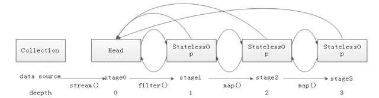

# stream

## 不变集合

```

```


## stream 流

结合Lambda表达式，简化集合、数组的操作

### 获取stream

1. 单列集合

```java
        ArrayList<String> list = new ArrayList<>();
        Collections.addAll(list, "a", "b", "c", "d", "e");

        Stream<String> stream1 = list.stream();
```

2. 双列集合

双列集合不存在stream

```java
        // 双列集合

        HashMap<String, Integer> hm = new HashMap<>();

        hm.put("aa", 11);
        hm.put("bb", 22);
        // 第一种
        hm.keySet().stream().forEach(s -> System.out.println(s));
        // 第二种
        hm.entrySet().stream().forEach(s -> System.out.println(s));
```

3. 基本类型数组

```java
      int[] arr1 = {1,2,3,4,5};
        Arrays.stream(arr1).forEach(s -> System.out.println(s));
```

4. 一堆零散数据
   ```java
           // 一堆零散数据
           // of 的 只能使用引用类型，不能用基本类型数组，会错误
           Stream<Integer> integerStream = Stream.of(1, 2, 3, 4, 5);

           integerStream.forEach(s -> System.out.println(s));
   ```


## 中间方法

1. filter
   过滤
2. limit
   取前几个
3. skip
   不取前几个
4. distinct
   去重     hashcode  equals
5. concat
   合并两个stream
6. map
   转换流中的数据类型
7. 
8. 
9. end


## 终结方法

1. forEach
2. count
3. toArray
   空参数 = Object[]
   1形参 = 指定类型

   ```java
   list.stream.toArray(value -> new String[value]);
   ```
4. collect

    如果收集到 map 中，key 不能重复，否则会报错

```java
list.stream.collect(Collections.toMap(x -> x.substring(1), y -> y.substring(3))))
```


## 原理

1. 双端链表

```java

```



[Java8 Stream原理深度解析 - 知乎 (zhihu.com)](https://zhuanlan.zhihu.com/p/52579165)

[JAVA Stream简单原理——手写一个Stream流 - 掘金 (juejin.cn)](https://juejin.cn/post/6934510249470590990)
