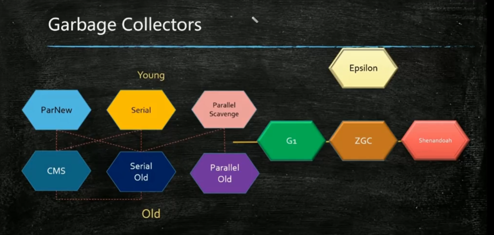

## GC

## GC

### tuning

1. 小   Serial
2. PS + PO
3. ParNew  + CMS

java 8  使用  G1 （java 9 默认）

CMS   是  mark-sweep ，有碎片， 并发标志，重新标志要从头开始扫描，

碎片满了如果再分配的时候，会退化成  serial Old

Remark 阶段

    CMS  G1 三色标记，

CMS  ： increment mark  有 bug

G1  ： SATB  snapshot at the begining

   ZGC  颜色指针

### 调优

1. 预调优，

日志分析工具

gceasy

11. cpu 暴增

top命令  找 CPU 最忙的 线程   jstack

1. 业务线程    调code
2. GC 线程    oom ，内存泄露

11. 死锁

jmap   内存图，看前 20个

jmap 生产不能用，除非 能隔离服务器

-XX:+HeapDumpOnOutOfMemoryError

有高可用， 流量重放  就可以复现，arthas 推荐
